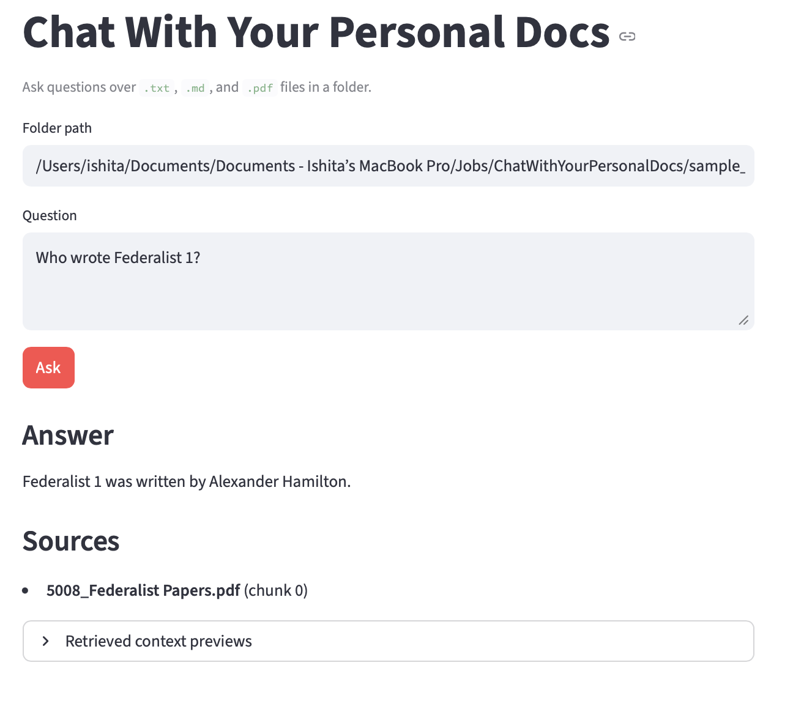
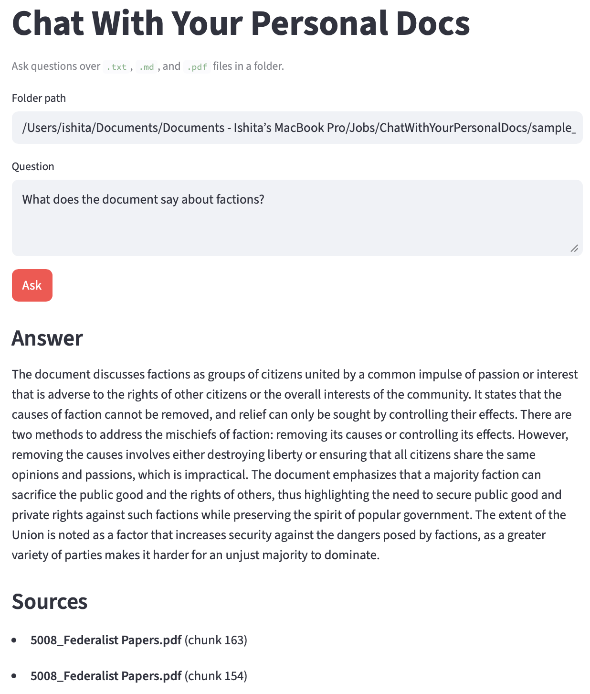
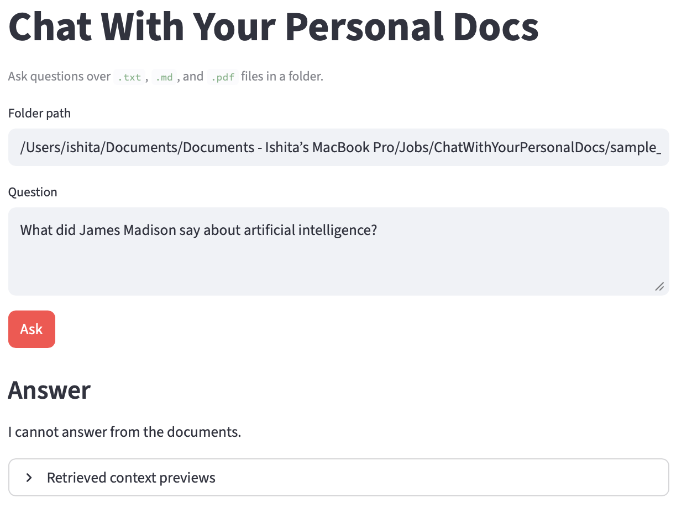
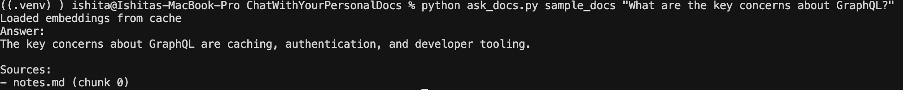
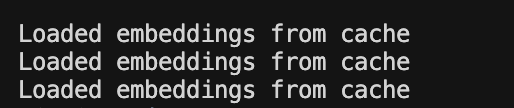

# Chat With Your Personal Docs

A small CLI + Streamlit app for asking natural-language questions over a local folder of personal documents.

It supports `.txt`, `.md`, and `.pdf` files, chunks the documents, retrieves relevant chunks with OpenAI embeddings, and answers using an OpenAI chat model with source attribution.

This was built as a scoped 2-hour take-home style project. I optimized for a working, understandable RAG pipeline over adding heavy infrastructure.

## Features

- Load documents from a local folder
- Support Markdown, plain text, and PDF files
- Extract PDF text with `pypdf`
- Chunk documents into overlapping chunks
- Retrieve relevant chunks using embeddings + cosine similarity
- Answer questions using only retrieved context
- Show source filenames and chunk indices
- Provide both CLI and Streamlit UI
- Cache embeddings locally to avoid recomputing unchanged files
- Include a small demo/eval script

## Setup

```bash
python3 -m venv .venv
source .venv/bin/activate

pip install -r requirements.txt

cp .env.example .env
```

Then edit `.env`:

```bash
OPENAI_API_KEY=your_real_openai_api_key
```

The app expects `OPENAI_API_KEY` either in `.env` or in the shell environment.

## Run the CLI

```bash
python ask_docs.py <folder_path> "<question>"
```

Example:

```bash
python ask_docs.py sample_docs "What are the key concerns about GraphQL?"
```

Example output:

```text
Answer:
The key concerns about GraphQL are caching, authentication, and developer tooling.

Sources:
- notes.md (chunk 0)
```

Long PDF example using the Federalist Papers PDF in `sample_docs`:

```bash
python ask_docs.py sample_docs "Who wrote Federalist 1?"
```

Example output:

```text
Answer:
Federalist 1 was written by Alexander Hamilton.

Sources:
- 5008_Federalist Papers.pdf (chunk 0)
```

## Run the Streamlit UI

```bash
streamlit run app.py
```

The UI lets the user enter:

* a local folder path
* a natural-language question

It displays:

* the answer
* sources
* retrieved context previews

## Run the demo/eval script

```bash
python demo_queries.py
```

The demo script runs a few representative questions against `sample_docs`, including:

* a specific lookup question
* a summary question
* an unanswerable question

## How it works

The pipeline is intentionally simple:

1. Recursively load `.txt`, `.md`, and `.pdf` files from the folder.
2. Extract text from PDFs using `pypdf`.
3. Split text into chunks of about 800 characters with 150 characters of overlap.
4. Attach metadata to each chunk: filename and chunk index.
5. Embed chunks with `text-embedding-3-small`.
6. Embed the user question.
7. Retrieve the top 5 chunks using cosine similarity.
8. Send those chunks to `gpt-4o-mini`.
9. Ask the model to answer only from the provided context.
10. Print/display the answer and relevant sources.

## Models used

| Purpose           | Model                    |
| ----------------- | ------------------------ |
| Embeddings        | `text-embedding-3-small` |
| Answer generation | `gpt-4o-mini`            |

## Important constants

```python
SUPPORTED_EXTENSIONS = {".txt", ".md", ".pdf"}
CHUNK_SIZE = 800
CHUNK_OVERLAP = 150
TOP_K = 5
SOURCE_SCORE_RATIO = 0.85
EMBEDDING_MODEL = "text-embedding-3-small"
CHAT_MODEL = "gpt-4o-mini"
CACHE_FILENAME = ".embeddings_cache.pkl"
```

## Embedding cache

The app stores a lightweight local cache at:

```text
<document_folder>/.embeddings_cache.pkl
```

The cache stores embeddings for unchanged files so repeated questions do not re-embed the whole folder.

The cache is invalidated when file modified times or chunk contents change.

This is a deliberate middle ground: it gives persistence and better repeated-query performance without adding an external vector database.

## Error handling

The app handles:

* missing folder
* empty folder
* unsupported files
* empty question
* missing or placeholder OpenAI API key
* unreadable files
* empty or image-only PDFs
* corrupt embedding cache
* unanswerable questions

For unanswerable questions, the model is instructed to say it cannot answer from the documents.

## Design choices

### Why a simple local RAG pipeline?

The assignment scope was about building a useful document QA prototype quickly. I prioritized:

* working end-to-end behavior
* readable code
* source attribution
* reasonable edge-case handling
* simple setup on a fresh clone

### Why not a full vector database?

For the expected scale of around 20 documents and roughly 50,000 words, an external vector DB felt unnecessary. A local embedding cache gives most of the useful benefit for this scale without adding Docker, hosted services, or extra setup complexity.

### Why OpenAI?

I used OpenAI embeddings and chat models because the main risk in this project was not model hosting; it was building a reliable document loading, retrieval, grounding, and source attribution flow in limited time.

## Additional Design Choices

A few small features were intentionally added beyond the base requirements:

- local embedding cache to reduce repeated embedding cost
- source filtering threshold to reduce noisy citations
- explicit refusal behavior for unsupported questions
- keyword retrieval debug mode for retrieval inspection

## Stress Testing

I tested the system against:
- large PDFs (~300-page Federalist Papers document)
- missing folders
- empty folders
- unanswerable questions
- repeated runs validating embedding cache reuse
- mixed file formats (.txt, .md, .pdf)

I also tested retrieval quality using both highly specific and broad summary questions.

## Limitations

* PDF extraction depends on `pypdf`; scanned PDFs or complex layouts may not work well.
* Retrieval is embedding-only in the main path; keyword retrieval is only a debug fallback.
* Source filtering is heuristic: sources shown must be within 85% of the top similarity score.
* The app passes top 5 chunks to the model, so weakly relevant chunks can still appear in context.
* There is no file upload flow; the user provides a local folder path.
* There is no external vector DB.
* Streamlit reloads the folder on each query instead of maintaining a richer session index.
* The answer-refusal detection is simple string matching.

## What I would do with another 4 hours

* Add hybrid retrieval combining embeddings and keyword/BM25 scoring.
* Add better PDF parsing for layout-heavy documents.
* Add Streamlit file upload support.
* Add session-level caching in the UI.
* Add structured JSON output from the model to separate answer confidence and cited chunks.
* Add a small automated eval harness with expected source files.
* Improve source precision by asking the model which retrieved chunks it actually used.

## UI and Example Runs

### Streamlit UI

The Streamlit UI supports:

* folder path input
* natural-language questions
* retrieved source previews



### Long-document retrieval

I tested long-document retrieval using the Federalist Papers PDF in `sample_docs` (~300 pages). The app chunks the extracted text, retrieves relevant passages, and answers specific questions such as authorship of individual papers.



### Hallucination / refusal behavior

When the retrieved context does not contain enough information, the model is instructed to refuse rather than guess. In that case, the app shows the answer only and omits the Sources section.



### CLI example

The CLI provides the same pipeline from the terminal for quick testing and scripting.



### Embedding cache behavior

Repeated runs on the same folder reuse cached embeddings for unchanged files, which speeds up follow-up questions and reduces API calls.



## Weakest part

The weakest part is source precision. The answer is grounded in retrieved chunks, but the app uses a heuristic score threshold to decide which sources to display. This works for the demo cases, but a stronger version would make the model return explicit cited chunk IDs or use a reranker before answer generation.
